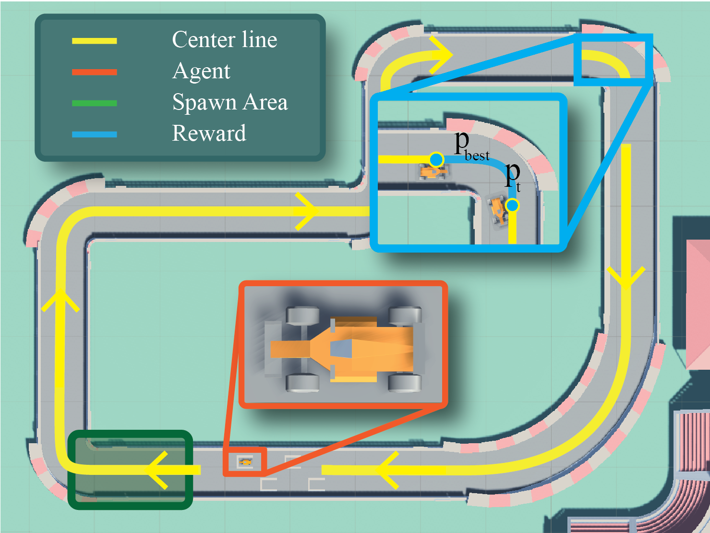

# OfflineMania: A Benchmark Environment for Offline Reinforcement Learning in Racing Games

[](http://arxiv.org/abs/2407.09415)



## Overview

Welcome to the **OfflineMania** repository! This novel environment for Offline Reinforcement Learning (ORL) research is inspired by the TrackMania series and developed using the Unity 3D game engine. It simulates a single-agent racing game with the objective of optimal track navigation, providing diverse datasets for ORL research.

## Abstract

Offline RL (ORL) reduces the high sample complexity of traditional RL by eliminating the need for continuous environmental interactions, using a dataset of pre-collected transitions. This repository introduces **OfflineMania**, a new environment built using the Unity 3D game engine. It provides datasets of varying sizes and expertise levels, establishing a challenging testbed for ORL algorithm development and evaluation. We also provide baseline results for a range of Online RL, ORL, and hybrid Offline to Online RL approaches.

## Environment Details

### State Space

The state space includes 15 raycasts covering a 180-degree field of view in front of the car and the car's (X, Y, Z) velocity components.

### Action Space

The action space consists of two continuous values:
- **Steering angle**: Ranges from -1 (left turn) to 1 (right turn).
- **Acceleration/Braking**: Ranges from -1 (braking/reversing) to 1 (full acceleration).

### Reward Signal

The reward function is progress-based with penalties for collisions scaling with the velocity of the car.

$$
    r_t = r_t^{\text{prog}} - 
    \begin{cases}
        \lambda \parallel v_{\text{car}}\parallel  & \text{if in contact with wall} \\
        0 & \text{otherwise}
    \end{cases}
$$


### Episode

Each episode has a fixed length of 2,000 steps with randomized start position and orientation to ensure variety in training scenarios.

## Datasets

- **Basic**: 100,000 transitions from a policy struggling with the initial corner.
- **Medium**: 100,000 transitions from a policy occasionally completing the track.
- **Expert**: 100,000 transitions from a high-performance policy.
- **Mix Large**: 200,000 transitions, combining 90% basic, 7% medium, and 3% expert.
- **Mix Small**: 5,000 transitions with the same mix ratio as Mix Large.
- **Basic Small**: 5,000 transitions from the basic policy.

## Installation

1. Clone the repository:
   ```bash
   git clone https://github.com/ganjiro/OfflineMania.git
   ```
2. Follow the official guide to install the [Unity ML-Agents Toolkit](https://github.com/Unity-Technologies/ml-agents/blob/develop/docs/Installation.md).

3. Install the required dependencies:
   ```bash
   pip install -r requirements.txt
   ```

4. **For Linux users only** set the permission to run the game using ML-Agents:
      ```bash
   chmod -R 755 Game/Linux/OfflineMania.x86_64
   ```

## Usage

The `main.py` script loads the selected dataset and launches an episode in the environment. Use the following commands to run the script:

**Launching on Windows:**
   ```bash
   python main.py --game_file 'Game/Windows/OfflineMania.exe' --dataset_path 'OfflineMania/Datasets' --dataset_name 'mixLarge'
   ```

**Launching on Linux:**
   ```bash
   python main.py --game_file 'Game/Linux/OfflineMania.x86_64' --dataset_path 'OfflineMania/Datasets' --dataset_name 'mixLarge'
   ```

## Acknowledgements

Our environment is based on [IR-Project](https://github.com/monidp9/IR-Project). We thank the author for releasing his code.

## Authors

- Girolamo Macaluso (University of Florence)
- Alessandro Sestini (SEED - Electronic Arts)
- Andrew D. Bagdanov (University of Florence)

## Citation
```bibtex
@misc{macaluso2024benchmarkenvironmentofflinereinforcement,
      title={A Benchmark Environment for Offline Reinforcement Learning in Racing Games}, 
      author={Girolamo Macaluso and Alessandro Sestini and Andrew D. Bagdanov},
      year={2024},
      eprint={2407.09415},
      archivePrefix={arXiv},
      primaryClass={cs.AI},
      url={https://arxiv.org/abs/2407.09415}, 
}
```

## Contact

For any inquiries, please contact:

- Girolamo Macaluso: girolamo.macaluso@unifi.it

